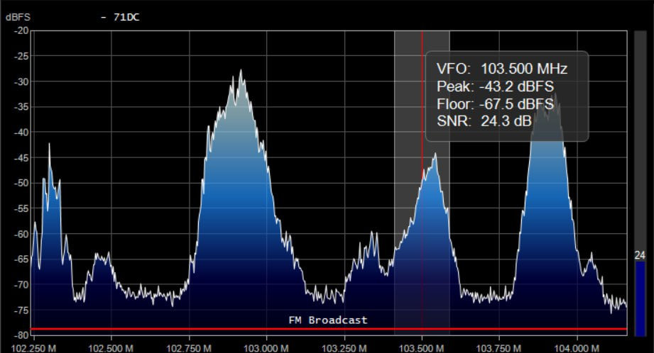
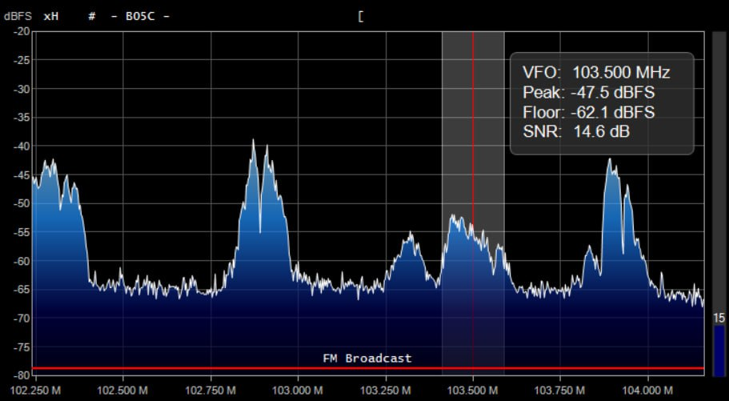

# SNR vs Tiempo

Sobre los archivos:

> [!NOTE]  
> El documento `SNR_103_5MHz_Oudoor.csv` corresponde a la imagen  `Outdoor.jpg` 

  

> [!IMPORTANT]  
> El documento `SNR_103_5MHz_Indoor.csv` ocurrió en un escenario indoor; dentro de un Laboratorio. corresponde a la imagen  `Indoor.jpg`

  

